

    <h1>AVT Fashion Warehouse Management System</h1>

## Introduction

The AVT Fashion Warehouse Management System is developed using C# with the C#.NET framework and ADO.NET, aimed at providing a comprehensive solution for warehouse management in the fashion industry. The project utilizes SQL Server for data storage and Jira for project management.

## Key Features

- **Registration & Login**:
  - Allows users to register accounts and log into the system.
  - Clear role-based permissions for Admin, Staff, and Warehouse Manager.

- **Statistical Reports**:
  - View reports on:
    - Sales
    - Number of employees
    - Number of customers
    - Work schedules
    - Bills
    - Products

- **Search & Filter Data**:
  - Supports quick search and data filtering based on various criteria.

- **File Export**:
  - Export data to files for easy storage and sharing.

- **Shift Registration**:
  - Employees can easily register their shifts.

- **CRUD Operations**:
  - Perform CRUD operations (Create, Read, Update, Delete) for:
    - Products
    - Employees
    - Customers
    - Goods
    - Work schedules

## Technologies Used

- **Language**: C Sharp
- **Framework & Library**: C#.NET, ADO.NET, Windows Forms
- **Database**: SQL Server
- **Project Management**: Jira

## Installation

To run this project, you need to install the following tools:

1. .NET SDK
2. SQL Server
3. An IDE like Visual Studio 2022

## Usage Instructions

1. Clone the repository to your machine:
   git clone + link website git code

## Some pictures of the project

    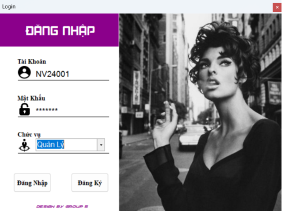
    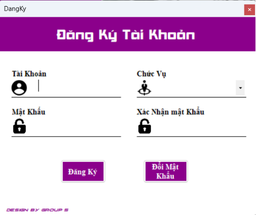
    
    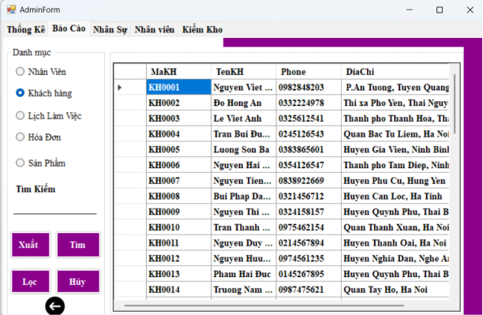
    
    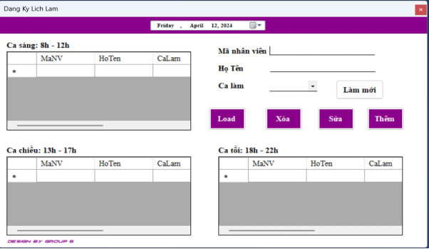
    
    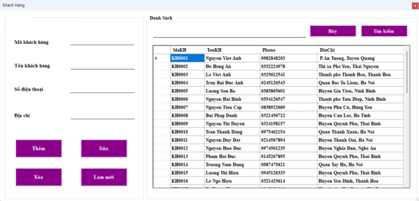
    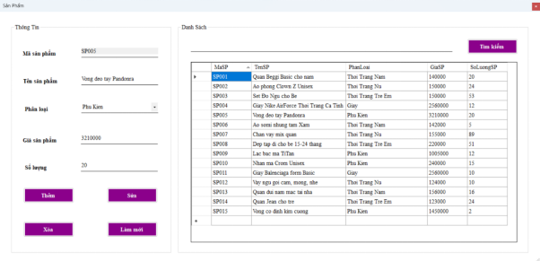
    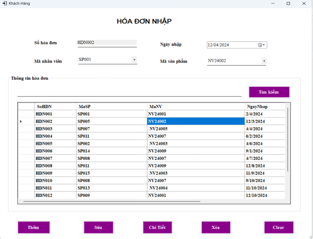
    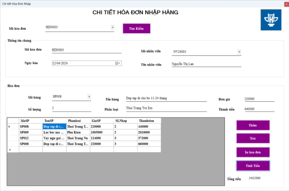
    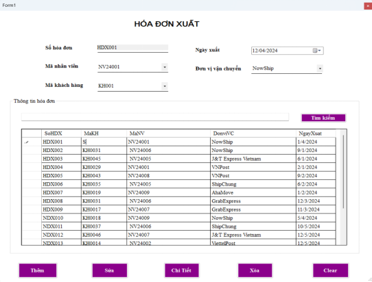
    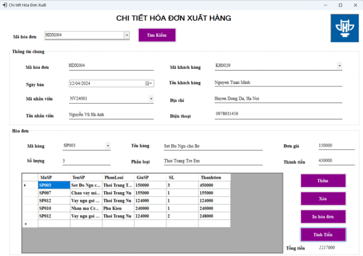
    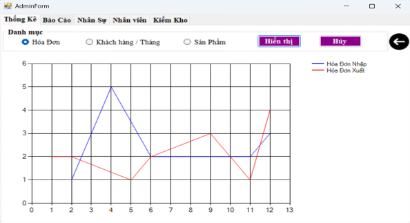
    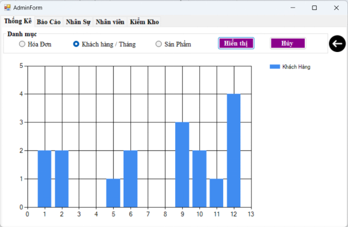
    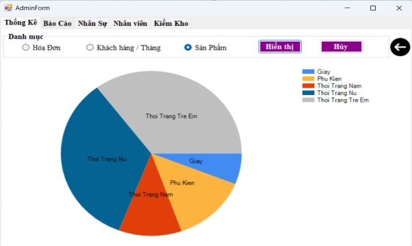

